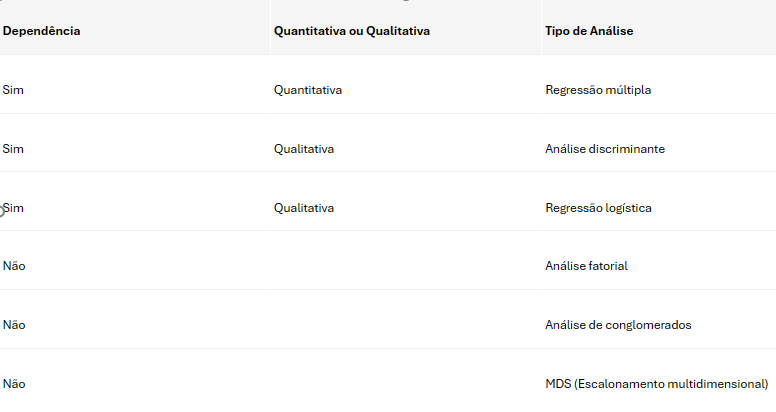
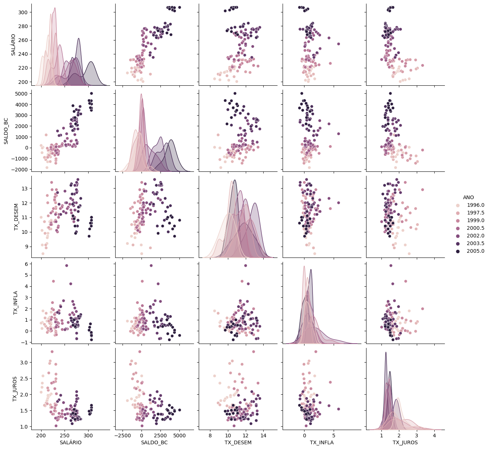
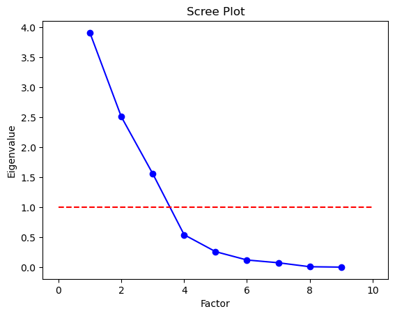
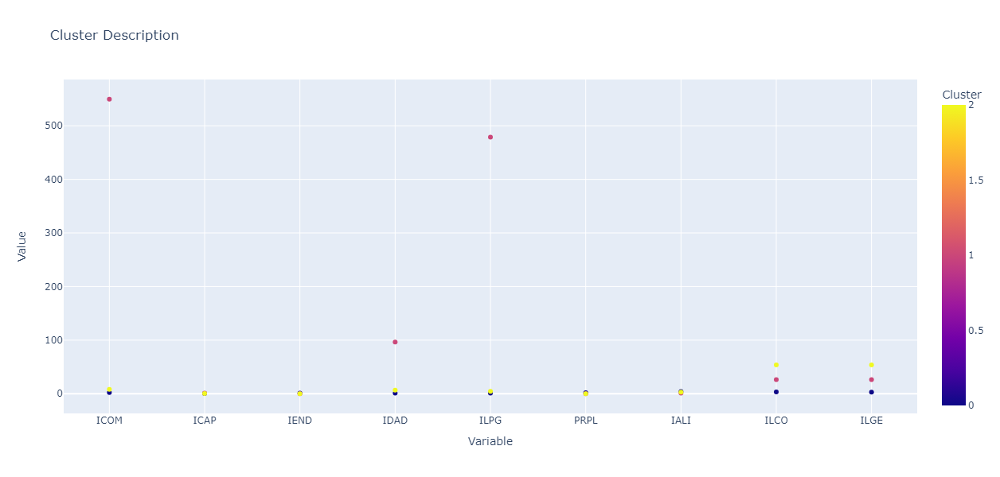

# Análise Multivariada de dados - Análise Fatorial

Aplicações em python com dados financeiros do livro Análise Multivariada da FEA-USP

 

## análises descritivas
file: desc.ipynb

##### estatísticas gerais
- describe
- Histogram
- Boxplot
- pairplot
- Scatterplot
- normaltest

 

## Análise Fatorial - Técnicas de interdependência

file: afatorial.ipynb

## Resumo em pontos-chave sobre a Análise Fatorial (AF):

**Objetivo:**

* Identificar dimensões de variabilidade comuns (fatores) em um conjunto de fenômenos.
* Desvendar estruturas existentes, mas não observáveis diretamente.

**Raciocínio:**

* Se os fenômenos variam independentemente, existem tantas dimensões quanto os próprios fenômenos.
* Se os fenômenos variam de forma dependente, existe um número menor de dimensões.
* A AF detecta padrões subjacentes e reagrupa os dados em um número menor de dimensões (fatores).

**Resumo:**

* A AF busca descrever um conjunto de variáveis originais através de um número menor de fatores.
* Maximiza o poder de explicação do conjunto de variáveis.
* Cada variável é explicada considerando todas as outras, incluindo os fatores latentes (F_{n}).

**Objetivo das técnicas de interdependência (AF inclusa):**

* Identificar uma estrutura de relacionamentos que explique as variações nas variáveis analisadas.
* Não prever o valor da variável dependente.

**Conceitos importantes:**

* Fator: Dimensão de variabilidade comum.
* Variável latente: Variável não observável diretamente.
* Técnicas de interdependência: Analisam as variáveis para explicar as relações entre elas.

**Aplicações da AF:**

* Psicologia: Identificar fatores de personalidade.
* Economia: Analisar fatores que influenciam o crescimento econômico.
* Marketing: Segmentar o mercado de consumo.
* Educação: Avaliar o desempenho de alunos.

**Observação:**

* A AF é uma técnica complexa com diferentes métodos e ferramentas.
* A escolha do método depende dos objetivos da pesquisa e das características dos dados.

**Bibliografia:**

* https://scikit-learn.org/stable/modules/generated/sklearn.decomposition.FactorAnalysis.html
* [https://pt.wikipedia.org/wiki/An%C3%A1lise_fatorial](https://pt.wikipedia.org/wiki/An%C3%A1lise_fatorial)
* [https://educacao-executiva.fgv.br/cursos/online/curta-media-duracao-online/introducao-tecnicas-de-analise-fatorial-e-conjunta-de-dados](https://educacao-executiva.fgv.br/cursos/online/curta-media-duracao-online/introducao-tecnicas-de-analise-fatorial-e-conjunta-de-dados)
* FIPECAFI - Fundação Instituto de Pesquisas Contábeis, Atuariais e Financeiras. (2009). Análise multivariada: para os cursos de administração, ciências contábeis e economia. 1. ed. - 2. reimpr. São Paulo: Atlas.

## Passos para a análise fatorial

1. Cálculo da matriz de correlação: nessa etapa é avaliado o grau de re- lacionamento entre as variáveis e a conveniência da aplicação da AF.

2. Extração dos fatores: determinação do método para cálculo dos fatore e definição do número de fatores a serem extraídos. Nessa etapa, busca se descobrir o quanto o modelo escolhido é adequado para represent os dados.

3. Rotação dos fatores: etapa na qual se busca dar maior capacidade interpretação dos fatores.

4. Cálculo dos escores: os escores resultantes desta fase podem ser util dos em diversas outras análises (análise discriminante, cluster, regres logística etc.).

# caso do mercado segurador brasileiro
- objetivo: classificar as empresas segundo sua capacidade econômico-financeira

### Indicadores financeiros

##### Índices de Estrutura de Capital:

- Índice de captações ICAP PTL/ATT

- Índice de Endividamento → IEND (PCD+ELP)/PTL

- Índice de Recursos Próprios em Giro → IRPG = (PTL-IMO-IVD-RLP)/ACL

- Índice de Imobilização de Recursos IIMR (IMO+IVD)/PTL

##### Índices de rentabilidade:

- Índice de Sinistralidade → ISIN = SRT/PGN

- Índice de Colocação do Seguro ICOL = DCM/PGN

- Índice de Despesas Administrativas → IDAD = DAD/PRT

- Índice de Lucratividade sobre Prêmio Ganho ILPG LLQ/PGN

- Índice de Retorno sobre o PLIRPL = LLQ/PTL

##### Índices de alavancagem:

- Índice de Solvência Prêmios → PRPL PRT/PTL

- Índice de Alavancagem Líquida → IALI (PRT+PCC+PCD)/PTL

- Índices de liquidez:

- Índice de Liquidez Corrente → ILCO = ACL/(PCC+PCD)

- Índice de Liquidez Geral → ILGE = (ACL+RLP)/(PCC+PCD+ELP)

##### Índices operacionais:

- Índice Combinado ICOM (SRT + DCM+ DAD)/PGN

- Índice Combinado Ampliado ICOA (SRT + DCM+ DAD)/(PGN + RFC)

Onde:

- ACL Ativo circulante
- ATT Ativo total
- DAD → Despesa administrativa
- DCM→ Despesa comercial
- ELP → Exigível a longo prazo
- IMO → Imobilizado
- IVD → Investimento e diferido
- LLQ→ Lucro Líquido
- PCC → Provisão comprometida circulante
- PCD → Passivo circulante - Demais
- PCP → Provisão comprometida
- PGN → Prêmio ganho
- PRT → Prêmio retido
- PTL → Patrimônio Líquido
- RFC → Resultado Financeiro
- RLP → Realizável a longo prazo
- SRT → Sinistro retido

## Resultados Análise Fatorial

* Component_1 is: ICOM, IDAD, ILPG
* Component_2 is: ICAP, PRPL, IALI
* Component_3 is: ILCO, ILGE

* Fator 1  - controle de despesas operacionais corresponde a 32,4% da variância explicada
* Fator 2  - alavancagem corresponde a 28,8% da variância explicada
* Fator 3  - liquidez corresponde a 23,3% da variância explicada

 

 

* clusters para separar empresas em grupos com a mesma característica dos indicadores

 