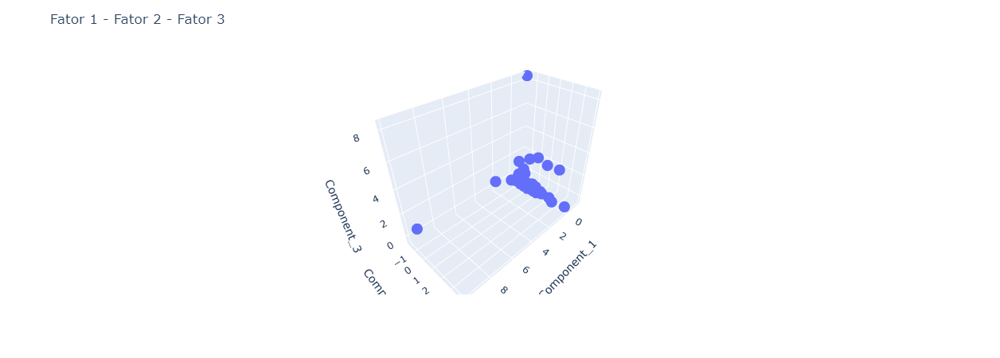

# Análise Multivariada de dados

Aplicações em python com dados financeiros do livro Análise Multivariada da FEA-USP

 

## análises descritivas
file: desc.ipynb

##### estatísticas
- describe
- Histogram
- Boxplot
- pairplot
- Scatterplot
- normaltest

 

## Análise Fatorial - Técnicas de interdependência

file: afatorial.ipynb

conceito: A Análise Fatorial (AF) é uma técnica estatística que busca, através da avalia- ção de um conjunto de variáveis, a identificação de dimensões de variabilidade comuns existentes em um conjunto de fenômenos; o intuito é desvendar estrutu- ras existentes, mas que não observáveis diretamente. Cada uma dessas dimensões de variabilidade comum recebe o nome de FATOR.

Um raciocínio subjacente dessa técnica é que se cada fenômeno varia independentemente dos demais, então existirão tantas dimensões quanto os próprios fenômenos analisados, mas se os fenômenos não variam independentemente, podendo haver relações de dependência entre eles, pode-se concluir que existe um menor número de dimensões de variação do que os fenômenos. A AF permite detectar a existência de certos padrões subjacentes nos dados, de maneira que possam ser reagrupados em um conjunto menor de dimensões ou fatores.

Resumidamente, a AF tem como um de seus principais objetivos tentar des- crever um conjunto de variáveis originais através da criação de um número menor de dimensões ou fatores.

Nas técnicas de interdependência, como no caso da AF, as variáveis (V) são analisadas com o intuito de maximizar o poder de explicação do conjunto de variáveis. Cada variável é explicada levando em consideração todas as outras, incluindo-se as variáveis latentes (Fatores -F_{n}).

O intuito das técnicas de interdependência não é o de prever o valor da variável dependente e sim identificar uma estrutura de relacionamentos que permita a explicação das variações ocorridas nas variáveis analisadas.

## Passos para a análise fatorial

1. Cálculo da matriz de correlação: nessa etapa é avaliado o grau de re- lacionamento entre as variáveis e a conveniência da aplicação da AF.

2. Extração dos fatores: determinação do método para cálculo dos fatore e definição do número de fatores a serem extraídos. Nessa etapa, busca se descobrir o quanto o modelo escolhido é adequado para represent os dados.

3. Rotação dos fatores: etapa na qual se busca dar maior capacidade interpretação dos fatores.

4. Cálculo dos escores: os escores resultantes desta fase podem ser util dos em diversas outras análises (análise discriminante, cluster, regres logística etc.).

# caso do mercado segurador brasileiro
- objetivo: classificar as empresas seundo sua capacidade econômico-financeira

### Indicadores financeiros

##### Índices de Estrutura de Capital:

- Índice de captações ICAP PTL/ATT

- Índice de Endividamento → IEND (PCD+ELP)/PTL

- Índice de Recursos Próprios em Giro → IRPG = (PTL-IMO-IVD-RLP)/ACL

- Índice de Imobilização de Recursos IIMR (IMO+IVD)/PTL

##### Índices de rentabilidade:

- Índice de Sinistralidade → ISIN = SRT/PGN

- Índice de Colocação do Seguro ICOL = DCM/PGN

- Índice de Despesas Administrativas → IDAD = DAD/PRT

- Índice de Lucratividade sobre Prêmio Ganho ILPG LLQ/PGN

- Índice de Retorno sobre o PLIRPL = LLQ/PTL

##### Índices de alavancagem:

- Índice de Solvência Prêmios → PRPL PRT/PTL

- Índice de Alavancagem Líquida → IALI (PRT+PCC+PCD)/PTL

- Índices de liquidez:

- Índice de Liquidez Corrente → ILCO = ACL/(PCC+PCD)

- Índice de Liquidez Geral → ILGE = (ACL+RLP)/(PCC+PCD+ELP)

##### Índices operacionais:

- Índice Combinado ICOM (SRT + DCM+ DAD)/PGN

- Índice Combinado Ampliado ICOA (SRT + DCM+ DAD)/(PGN + RFC)

Onde:

- ACL Ativo circulante
- ATT Ativo total
- DAD → Despesa administrativa
- DCM→ Despesa comercial
- ELP → Exigível a longo prazo
- IMO → Imobilizado
- IVD → Investimento e diferido
- LLQ→ Lucro Líquido
- PCC → Provisão comprometida circulante
- PCD → Passivo circulante - Demais
- PCP → Provisão comprometida
- PGN → Prêmio ganho
- PRT → Prêmio retido
- PTL → Patrimônio Líquido
- RFC → Resultado Financeiro
- RLP → Realizável a longo prazo
- SRT → Sinistro retido

## Resultados Análise Fatorial

Component_1 is: ICOM, IDAD, ILPG
Component_2 is: ICAP, PRPL, IALI
Component_3 is: ILCO, ILGE

* Fator 1  - controle de despesas operacionais corresponde a 32,4% da variância explicada
* Fator 2  - alavancagem corresponde a 28,8% da variância explicada
* Fator 3  - alavancagem corresponde a 23,3% da variância explicada

 

 

* clusters para separa empresas em grupos com a mesma característica dos indicadores

 